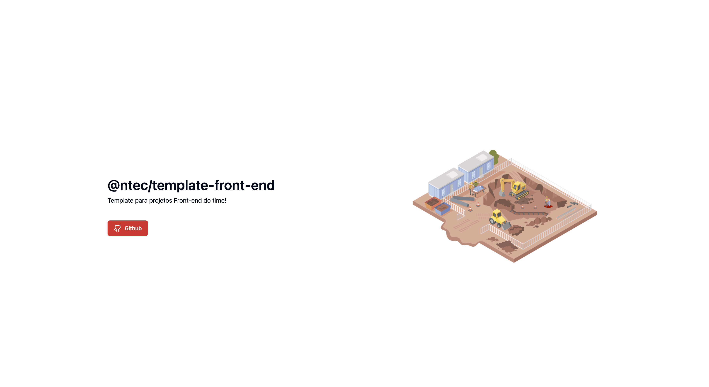

# [Nome do projeto]
Template base para desenvolver novos projetos Back-end.



## 🚀 Tecnologias
- [Express](https://expressjs.com/pt-br/) - Framework
- [Typescript](https://www.typescriptlang.org/) - Superset do javascript
- [Prisma](https://www.prisma.io/) - Gerenciador de rotas do React
- [Yup](https://www.npmjs.com/package/yup) - Validador de schemas typescript

## 📦️ Pré-Requisitos
Antes de começar você vai precisar ter instalado na sua máquina as ferramentas [Git](https://git-scm.com/) e [Docker](https://www.docker.com/).

## ⚡ Executando o projeto
1. Clone o repositório
```
  git clone [repo]
```
2. Acesse o container do node e rode o comando para instalar as dependências na pasta principal
```
  npm install
```
3. Rode o comando para rodar a aplicação
```
  npm run dev
```
4. Acesse pelo navegador
```
  http://localhost:[PORT]
```
