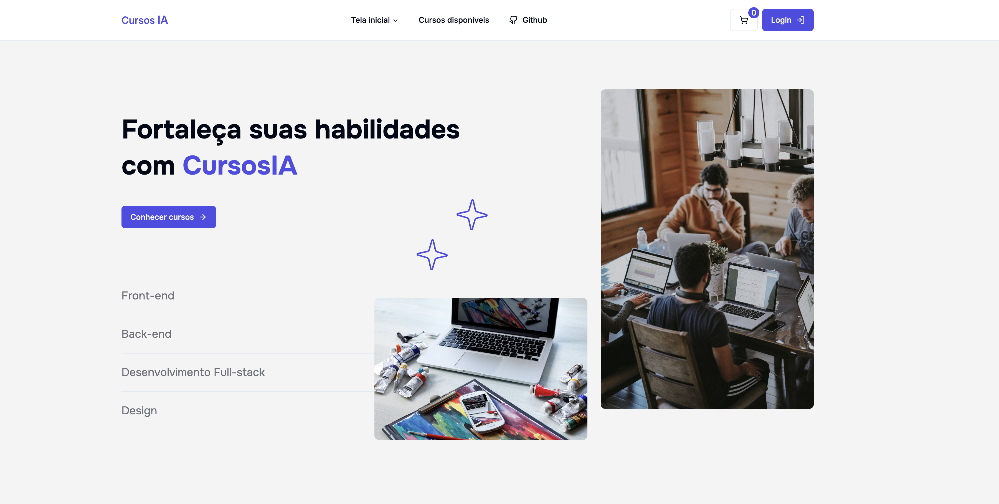

# Feedback IA - Front-end
Front-end voltado a vendas de cursos! Com integrações ao Stripe, Gemini e GoogleOAuth.



## 🚀 Tecnologias
- [React](https://react.dev/) - Framework web
- [Typescript](https://www.typescriptlang.org/) - Superset do javascript
- [React Router Dom](https://reactrouter.com/en/main) - Gerenciador de rotas do React
- [Vite](https://vitejs.dev/) - Bundler e dev-server
- [Shadcn/UI](https://ui.shadcn.com/) - Componentes com funcionalidades prontas para interface
- [Tailwind CSS](https://tailwindcss.com/) - Framework CSS
- [Lucide](https://lucide.dev/) - Lib de ícones
- [Zod](https://zod.dev/) - Validador de schemas typescript

## 📦️ Pré-Requisitos
Antes de começar você vai precisar ter instalado na sua máquina as ferramentas [Git](https://git-scm.com/).

## ⚡ Executando o projeto
1. Clone o repositório
```
  git clone https://github.com/DouglasLacerdaC/feedback-ia
```
2. Acesse o container do node e rode o comando para instalar as dependências na pasta principal
```
  npm install
```
3. Rode o comando para rodar a aplicação
```
  npm run dev
```
4. Acesse pelo navegador
```
  http://localhost:[PORT]
```
